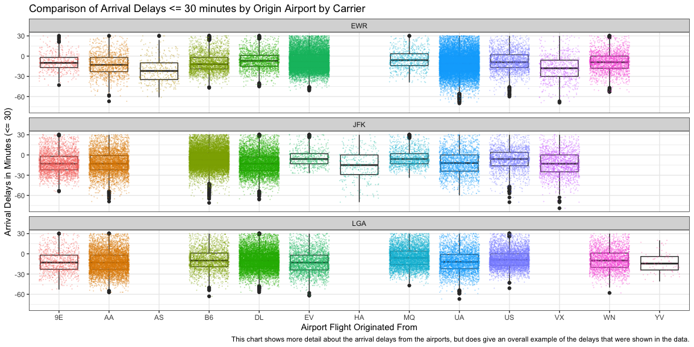
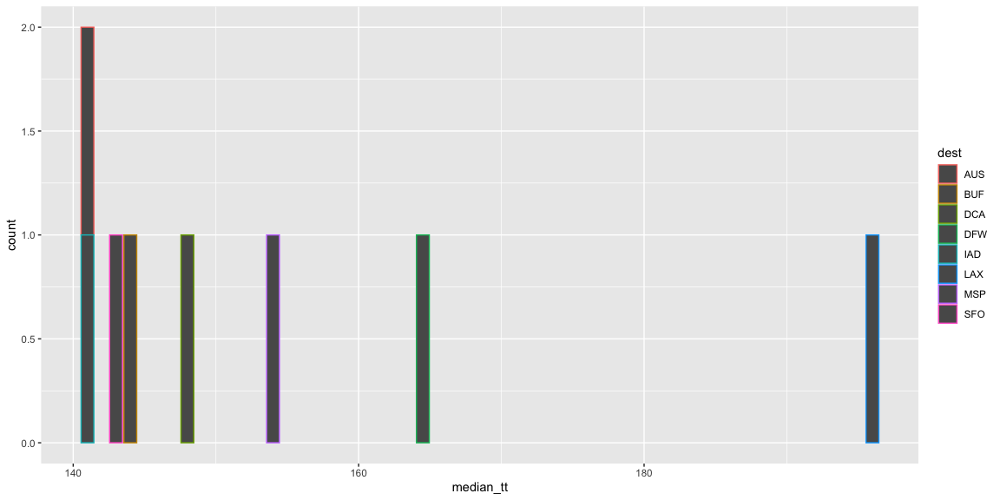

```r
# Use this R-Chunk to import all your datasets!
flight_data_T3 <- nycflights13::flights
```

## Background

#### Give Your Visualization Wings to Fly

You just started your internship at a big firm in New York, and your manager gave you an extensive file of flights that departed JFK, LGA, or EWR in 2013. Your manager wants you to answer the following questions using data from in nycflights::flights:

1. If I am leaving before noon, which two airlines do you recommend at each airport (JFK, LGA, EWR) that will have the lowest delay time at the 75th percentile?

2. Which origin airport is best to minimize my chances of a late arrival when I am using Delta Airlines?

3. Which destination airport is the worst (you decide on the metric for worst) airport for arrival time?

## Analysis 

#### Question 1:

Ultimately I found the simple table chart to be the most stratightforward way to quickly see which flights have the lowest delay time in the 75th percentile.  "Q3" represents Quartile 3 from a boxplot which is the same as the 75th percentile.  

I did not have the time to put the data in order, but I felt like there are few enough rows that it should be fairly easy to see.  Sometimes, the fastest solution is the easiest.


```r
# Trying to determine which 2 airlines have the shortest arrival delays of flights that leave before noon at each airports.
fltdy1 <- nycflights13::flights %>%
  select(origin, carrier, dep_delay, arr_delay, dep_time) %>% 
  filter(dep_time <= 1200 & carrier != "FL" & carrier != "F9") %>% 
  group_by(origin, carrier) %>%
  summarise(Q3 = quantile(arr_delay, 0.75, na.rm = T), max = max(arr_delay, na.rm = T)) %>%
  select(Q3, origin, carrier, max)
```
-----

##### 75th Percentile (Q3) Arrival Delays at JFK
###### Recommendation: DL & VX

I would recommend your using DL as your first choice from JFK. At the 75th percentile, DL planes that depart from JFK arrive at their destination 1 minute early. 

I would recommend your using VX as your second choice from JFK. At the 75th percentile, VX planes that depart from JFK arrive at their destination 1 minute late. 


```r
JFK_delay <- fltdy1 %>% 
  filter(origin == "JFK")
pander(JFK_delay)
```


------------------------------
 Q3   origin   carrier   max  
---- -------- --------- ------
 3     JFK       9E      744  

 2     JFK       AA      1007 

 9     JFK       B6      445  

 -1    JFK       DL      931  

 6     JFK       EV      493  

 2     JFK       HA      1272 

 6     JFK       MQ      989  

 4     JFK       UA      373  

 7     JFK       US      232  

 1     JFK       VX      408  
------------------------------

-----

##### 75th Percentile (Q3) Arrival Delays at EWR
###### Recommendation: VX & AA

I would recommend your using VX as your first choice from EWR. At the 75th percentile, VX planes that depart from EWR arrive at their destination 3 minutes early. 

I would recommend your using AA as your second choice from EWR. At the 75th percentile, VX planes that depart from EWR arrive at their destination 1 minute early.


```r
EWR_delay <- fltdy1 %>%
  filter(origin == "EWR")
pander(EWR_delay)
```


------------------------------
 Q3   origin   carrier   max  
---- -------- --------- ------
 2     EWR       9E      311  

 -1    EWR       AA      878  

 -9    EWR       AS      198  

 0     EWR       B6      366  

 3     EWR       DL      847  

 8     EWR       EV      463  

 10    EWR       MQ      1109 

 3     EWR       UA      352  

 4     EWR       US      229  

 -3    EWR       VX      287  

 2     EWR       WN      399  
------------------------------

-----

##### 75th Percentile (Q3) Arrival Delays at LGA
###### Recommendation: YV & AA

I would recommend your using YV as your first choice from LGA. At the 75th percentile, YV planes that depart from LGA arrive at their destination 4 minutes early. 

I would recommend your using AA as your second choice from LGA. At the 75th percentile, VX planes that depart from LGA arrive at their destination 1 minute late.


```r
LGA_delay <- fltdy1 %>%
  filter(origin == "LGA")
pander(LGA_delay)
```


-----------------------------
 Q3   origin   carrier   max 
---- -------- --------- -----
 2     LGA       9E      246 

 1     LGA       AA      802 

 5     LGA       B6      364 

 2     LGA       DL      821 

 3     LGA       EV      291 

 8     LGA       MQ      305 

 2     LGA       UA      378 

 2     LGA       US      485 

 3     LGA       WN      334 

 -4    LGA       YV      42  
-----------------------------

-----

This chart shows the complexity of the data involved in this assumption.  Typically, a boxplot is the best way to determine the 75th percentile.  All data below the top line of the white box represents the 75th percentile.  With this much data it is difficult to tell which airline has the lowest delay at 75%.  


```r
# Use this R-Chunk to plot & visualize your data!
fltdy1a <- nycflights13::flights %>%
  select(origin, carrier, dep_delay, arr_delay, dep_time) %>% 
  filter(dep_time <= 1200 & carrier != "FL" & carrier != "F9") %>% 
  group_by(origin, carrier) %>%
  select(arr_delay, carrier, origin, dep_time, dep_delay)

ggplot(data = fltdy1a, aes(x = carrier, y = arr_delay)) +
  geom_jitter(inherit.aes = TRUE, height = 0, size = 0.025, alpha = 0.25, aes(color = carrier)) +
  geom_boxplot() +
  facet_wrap(~origin, ncol = 1) +
  labs(title = "Comparison of Arrival Delays by Origin Airport by Carrier", caption = "This chart make little distinction between the arrival delays from the airports, but does give an overall example of the delays that were shown in the data.",
       x = "Airport Flight Originated From", y = "Arrival Delays in Minutes") +
  theme_bw() +
  theme(legend.position = "none")
```

<!-- -->

We can try getting closer to the data by looking at flights with arrival delays of 30 minutes or less, but there is still too much data to look at. In side the box represents 50 percent of the arrival times of the total number of flights per carrier. 

*Each dot represents a single flight, which is helpful to understand the number of flights we are using for our comparison values.*


```r
# Use this R-Chunk to plot & visualize your data!
fltdy1c <- nycflights13::flights %>%
  select(origin, carrier, dep_delay, arr_delay, dep_time) %>% 
  filter(dep_time <= 1200 & carrier != "FL" & carrier != "F9" & arr_delay <= 30) %>% 
  group_by(origin, carrier) %>%
  select(arr_delay, carrier, origin, dep_time, dep_delay)

ggplot(data = fltdy1c, aes(x = carrier, y = arr_delay)) +
  geom_boxplot() +
  geom_jitter(inherit.aes = TRUE, height = 0, size = 0.025, alpha = 0.25, aes(color = carrier)) +
  facet_wrap(~origin, ncol = 1) +
  labs(title = "Comparison of Arrival Delays <= 30 minutes by Origin Airport by Carrier", caption = "This chart shows more detail about the arrival delays from the airports, but does give an overall example of the delays that were shown in the data.",
       x = "Airport Flight Originated From", y = "Arrival Delays in Minutes (<= 30)") +
  theme_bw() +
  theme(legend.position = "none")
```

<!-- -->

-----

## Conclusion:

In this chart we will remove all the data, except the top line of the boxplot which represents the 75th percentile. From this chart, you can quickly see which two airlines are the lowest.

EWR- AS & VX
JFK- DL & VX
LGA- YV & AA or US


```r
fltdy2a <- nycflights13::flights %>%
  select(origin, carrier, dep_delay, arr_delay, dep_time) %>% 
  filter(dep_time <= 1200 & carrier != "FL" & carrier != "F9") %>% 
  group_by(origin, carrier) %>%
  summarise(Q3 = quantile(arr_delay, 0.75, na.rm = T))

ggplot(data = fltdy2a, aes(x = carrier, y = Q3)) +
  geom_boxplot() +
  facet_wrap(~origin, ncol = 1) +
  labs(title = "Comparison of Arrival Delays by Origin Airport by Carrier", caption = "This chart make little distinction between the arrival delays from the airports, but does give an overall example of the delays that were shown in the data.",
       x = "Airport Flight Originated From", y = "Arrival Delays in Minutes") +
  theme_bw() +
  theme(legend.position = "none")
```

<!-- -->

## Analysis:

#### Question 2:

##### Worst Airport Arrival Time
###### Recommendation: Avoid LAX

This chart shows the median true arrival time by airport.  To find the true arrival time, I subtracted any gains or losses due to departure time.  I found the median true arrival time for each airport and used that amount to determine which airports had the worst delay times.


```r
fltdy4 <- (nycflights13::flights) %>%
  group_by(dest) %>%
  filter(dep_delay != "NA" & arr_delay != "NA", tailnum != "N635AA" & dep_delay <= 0) %>%
  mutate(true_time = (arr_delay-dep_delay)) %>%
  filter(true_time > 140) %>%
  summarise(median_tt = median(true_time)) %>% 
  select(dest, median_tt)

ggplot(data = fltdy4, aes(x = median_tt)) +
  geom_bar(aes(color = dest))
```

<!-- -->

## Conclusion:

LAX has a median arrival delay of 196 minutes.  LAX is also one of the largest airports in the US, and there is plenty of data to support this.

I have personally sat on the tarmac for over an hour after I landed at LAX waiting for our turn to dismbark.  Doing this report will help me to remember to avoid LAX when I go to California.
