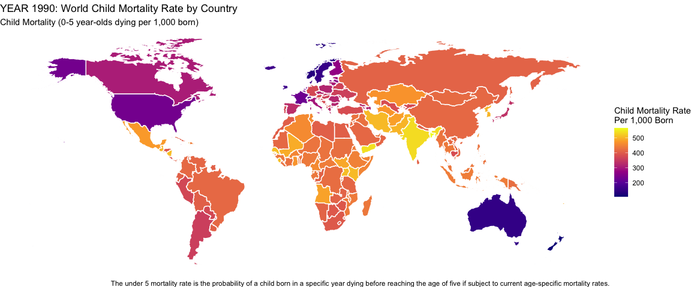

## Background

Child Mortality and Life Expectancy by country data from:
https://ourworldindata.org/financing-healthcare/


```r
# Upload world map data 

world_map <- map_data("world") %>% 
  mutate(region = replace(region, region == "Antigua", "Antigua and Barbuda")) %>% 
  mutate(region = replace(region, region == "Barbuda", "Antigua and Barbuda")) 

#join the two datasets by region

fin_dat.map <- left_join(fin_dat, world_map, by = "region")
```
-----

## Graphs

#### Comparison of 100 Year Child Mortality Rate

How has the childhood mortality rate decreased over the past 100 years?


```r
# child mortality rate in the year 1900

mort_1900 <-  fin_dat.map %>% 
  filter(year == "1900")

ggplot(data = mort_1900, aes(map_id = region, fill = child_mort)) +
  geom_map(map = mort_1900, color = "white") +
  expand_limits(x = mort_1900$long, y = mort_1900$lat) +
  scale_fill_viridis_c(option = "C") +
  labs(title = "YEAR 1990: World Child Mortality Rate by Country", subtitle= "Child Mortality (0-5 year-olds dying per 1,000 born)", fill = "Child Mortality Rate\nPer 1,000 Born", x = "Year 1900", caption = "The under 5 mortality rate is the probability of a child born in a specific year dying before reaching the age of five if subject to current age-specific mortality rates.")
```

<!-- -->


```r
#child mortality rate in the year 2000

mort_2000 <-  fin_dat.map %>% 
  filter(year == "2000")

ggplot(data = mort_2000, aes(map_id = region, fill = child_mort)) +
  geom_map(map = mort_2000, color = "white") +
  expand_limits(x = mort_2000$long, y = mort_2000$lat) +
  scale_fill_viridis_c(option = "C") +
  labs(title = "YEAR 2000: World Child Mortality Rate by County", subtitle= "Child Mortality (0-5 year-olds dying per 1,000 born)", fill = "Child Mortality Rate\nPer 1,000 Born", x = "Year: 2000", caption = "The under 5 mortality rate is the probability of a child born in a specific year dying before reaching the age of five if subject to current age-specific mortality rates.")
```

<!-- -->

-----

#### Comparison of 50 Year Life Expectancy

How has the life expectancy for adults changed over the past 50 years?


```r
#Life Expectancy in 1960
plot_1960 <-  fin_dat.map %>% 
  filter(year == "1960")

ggplot(data = plot_1960, aes(map_id = region, fill = lifeExp)) +
  geom_map(map = plot_1960, color = "white") +
  expand_limits(x = plot_1960$long, y = plot_1960$lat) +
  scale_fill_viridis_c(option = "A") +
  labs(title = "YEAR 1960: World Life Expectancy by Country", subtitle = "Life expectancy at birth, total (years)", fill = "Life Expectancy\nRate in Years", x = "Year: 1960", caption = "Life expectancy at birth, total (years). Indicates the number of years a newborn infant would live if prevailing patterns of mortality at the time of its birth were to stay the same throughout its life.")
```

<!-- -->


```r
# Use this R-Chunk to plot & visualize your data!
plot_2010 <-  fin_dat.map %>% 
  filter(year == "2010")

ggplot(data = plot_2010, aes(map_id = region, fill = lifeExp)) +
  geom_map(map = plot_2010, color = "white") +
  expand_limits(x = plot_2010$long, y = plot_2010$lat) +
  scale_fill_viridis_c(option = "A") +
  labs(title = "YEAR 2010: World Life Expectancy by Country", subtitle = "Life expectancy at birth, total (years)", fill = "Life Expectancy\nRate in Years", x = "Year:1990",caption ="Life expectancy at birth, total (years). Indicates the number of years a newborn infant would live if prevailing patterns of mortality at the time of its birth were to stay the same throughout its life.")
```

<!-- -->

-----

## Conclusions

There have been considerable changes in infant mortality rates over the past 100 years.  There have also been considerable increased life expectancy over the past 50 years.

In conclusion, these graphs were a lot of work and a fun learning project. however I do think there are probably more efficient ways to show the data.  I was limited to a discrete year variable with this data, it would have been helpful to use a range or spend more time showing more than a single year.
