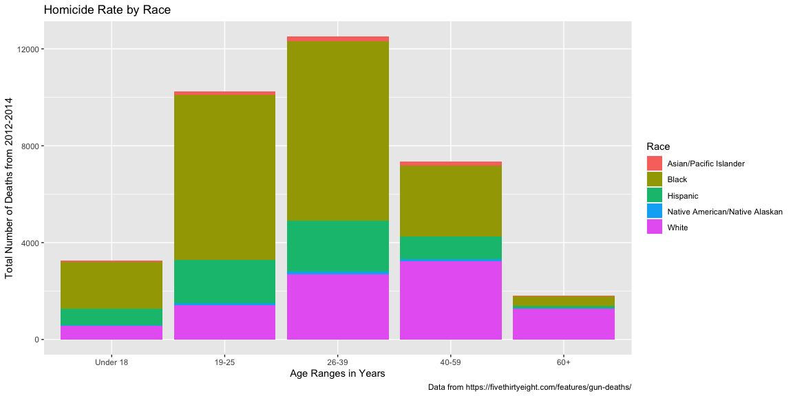
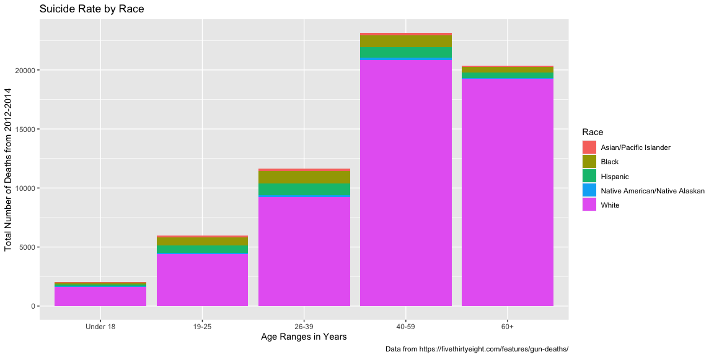
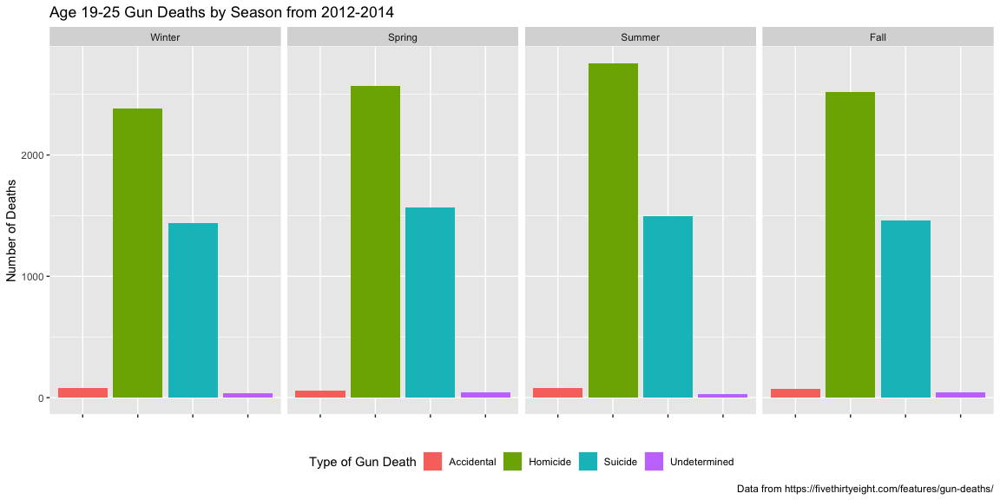
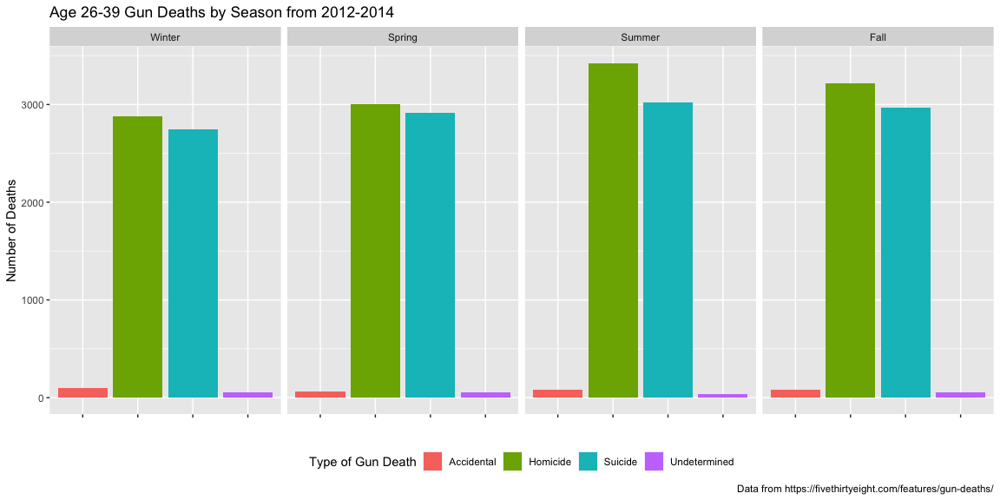
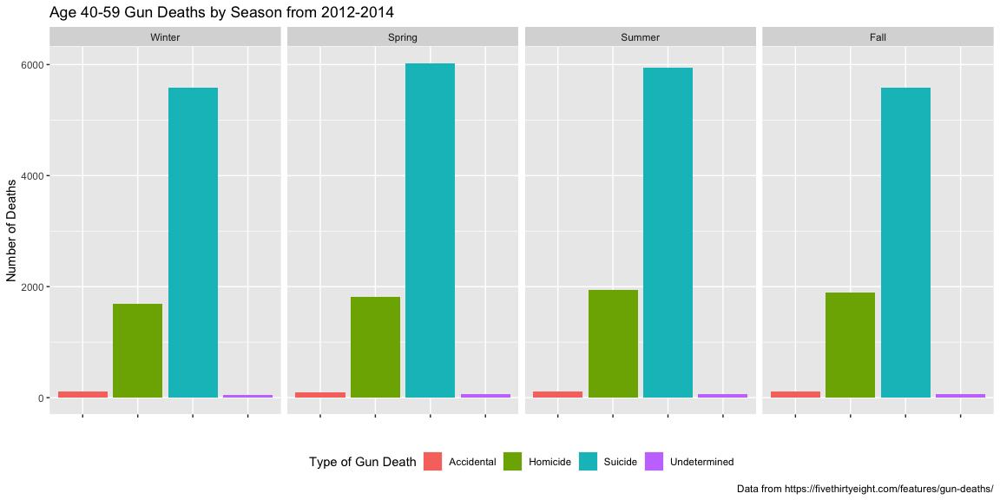

-----

## Reducing Gun Deaths (FiveThirtyEight Article)
https://fivethirtyeight.com/features/gun-deaths/

"The data in this interactive graphic comes primarily from the Centers for Disease Control and Prevention’s Multiple Cause of Death database, which is derived from death certificates from all 50 states and the District of Columbia and is widely considered the most comprehensive estimate of firearm deaths."

The purpose of this article and data is to provide insight into gun deaths in America.  Overall, the article uses a very powerful, interactive graphic to educate people on the impact of gun deaths on different age groups, races and genders.  The article provides a comprehensive look into the way the data was collected and used to tell the story.  As a student of statistics, I found their overview to provide support for the authenticity and accuracy of their report.

-----

## Background

Client is creating commmercials to reduce gun deaths in the U.S.  Client would like to create seasonal commercials to target audiences using seasonal gun death trends throughtout the year.

-----

## Data Wrangling


```r
gun_data <- read_csv("https://raw.githubusercontent.com/fivethirtyeight/guns-data/master/full_data.csv", 
    col_types = cols(month = col_number(), 
        year = col_date(format = "%Y")), 
    na = "NA")

gun_data2 <- gun_data %>%
  filter(intent != "NA" & age != "NA") %>%
  mutate(
    season = case_when(
      month %in% c(12, 1,2) ~ "Winter",
      month %in% c(3,4,5) ~ "Spring",
      month %in% c(6,7,8) ~ "Summer",
      month %in% c(9,10,11) ~ "Fall"), 
    age_group = cut(age, breaks =c(-1, 18, 25, 39, 59, 107), labels = c("Under 18", "19-25", "26-39", "40-59", "60+")),
  ) %>%
  select(year, season, race, sex, age_group, intent)
```

#### FiveThirtyEight Comparison

Here is an example showing that black youth and adults ages 19-40 are the largest racial group affected by homicide. 


```r
black_deaths <- gun_data2 %>%
  filter(intent == "Homicide") %>%
  select(season, race, age_group, intent)

ggplot(data = black_deaths, aes(x = race, fill = race)) +
  geom_bar(stat = "count", aes(x = age_group, group = race)) +
  labs(title = "Homicide Rate by Race", 
        x = "Age Ranges in Years",
        y = "Total Number of Deaths from 2012-2014", 
        fill = "Race", caption = "Data from https://fivethirtyeight.com/features/gun-deaths/")
```

<!-- -->

This chart shows that the largest racial group affected by suicide in all ages are white, with the highest being those over the age of 40.


```r
white_deaths <- gun_data2 %>%
  filter(intent == "Suicide") %>%
  select(season, race, age_group, intent)

ggplot(data = white_deaths, aes(x = race, fill = race)) +
  geom_bar(stat = "count", aes(x = age_group, group = race)) +
  labs(title = "Suicide Rate by Race", 
        x = "Age Ranges in Years",
        y = "Total Number of Deaths from 2012-2014", 
        fill = "Race", caption = "Data from https://fivethirtyeight.com/features/gun-deaths/")
```

<!-- -->

#### Commercial Recommendations

##### Overall Gun Deaths By Season and Intent

This chart shows the number of gun deaths by intention, among all age groups, sorted by season.


```r
ggplot(data = gun_data2, aes(x = season, fill = season)) +
  geom_bar(stat = "count") +
  facet_grid(~intent, scales = "free_y") +
  labs(title = "Total Gun Deaths by Season from 2012-2014", x = "Type of Gun Deaths", y = "Number of Gun Deaths", fill = "Season", caption = "Data from https://fivethirtyeight.com/features/gun-deaths/") +
  theme(legend.position = "bottom")
```

<!-- -->

##### Gun Deaths Sorted by Age
Most advertising targets an age group, and the following five charts can be used by the client to focus ads on the various age groups, by the biggest need.  

```r
under_18 <- gun_data2 %>% 
  filter(age_group == "Under 18") %>% 
  mutate(season = factor(season, levels = c("Winter", "Spring", "Summer", "Fall"))) %>%
  ggplot(aes(x = intent, fill = intent)) +
  geom_bar(stat = "count") +
  facet_wrap(~ season, nrow = 1) +
  labs(title = "Under 18 Gun Deaths by Season from 2012-2014", x = "",
        y = "Number of Deaths", 
        fill = "Type of Gun Death", caption = "Data from https://fivethirtyeight.com/features/gun-deaths/") +
  theme(legend.position = "bottom", 
        axis.text.x = element_blank())

under_18
```

<!-- -->


```r
age1925 <- gun_data2 %>% 
  filter(age_group == "19-25") %>% 
  mutate(season = factor(season, levels = c("Winter", "Spring", "Summer", "Fall"))) %>%
  ggplot(aes(x = intent, fill = intent)) +
  geom_bar(stat = "count") +
  facet_wrap(~ season, nrow = 1) +
  labs(title = "Age 19-25 Gun Deaths by Season from 2012-2014", x = "",
        y = "Number of Deaths", 
        fill = "Type of Gun Death", caption = "Data from https://fivethirtyeight.com/features/gun-deaths/") +
  theme(legend.position = "bottom", 
        axis.text.x = element_blank())

age1925
```

<!-- -->


```r
age2639 <- gun_data2 %>% 
  filter(age_group == "26-39") %>% 
  mutate(season = factor(season, levels = c("Winter", "Spring", "Summer", "Fall"))) %>%
  ggplot(aes(x = intent, fill = intent)) +
  geom_bar(stat = "count") +
  facet_wrap(~ season, nrow = 1) +
  labs(title = "Age 26-39 Gun Deaths by Season from 2012-2014", x = "",
        y = "Number of Deaths", 
        fill = "Type of Gun Death", caption = "Data from https://fivethirtyeight.com/features/gun-deaths/") +
  theme(legend.position = "bottom", 
        axis.text.x = element_blank())

age2639
```

<!-- -->


```r
age4059 <- gun_data2 %>% 
  filter(age_group == "40-59") %>% 
  mutate(season = factor(season, levels = c("Winter", "Spring", "Summer", "Fall"))) %>%
  ggplot(aes(x = intent, fill = intent)) +
  geom_bar(stat = "count") +
  facet_wrap(~ season, nrow = 1) +
  labs(title = "Age 40-59 Gun Deaths by Season from 2012-2014", x = "",
        y = "Number of Deaths", 
        fill = "Type of Gun Death", caption = "Data from https://fivethirtyeight.com/features/gun-deaths/") +
  theme(legend.position = "bottom", 
        axis.text.x = element_blank())

age4059
```

<!-- -->


```r
age60 <- gun_data2 %>% 
  filter(age_group == "60+") %>% 
  mutate(season = factor(season, levels = c("Winter", "Spring", "Summer", "Fall"))) %>%
  ggplot(aes(x = intent, fill = intent)) +
  geom_bar(stat = "count") +
  facet_wrap(~ season, nrow = 1) +
  labs(title = "Age 60+ Gun Deaths by Season from 2012-2014", x = "",
        y = "Number of Deaths", 
        fill = "Type of Gun Death", caption = "Data from https://fivethirtyeight.com/features/gun-deaths/") +
  theme(legend.position = "bottom", 
        axis.text.x = element_blank())

age60
```

<!-- -->

