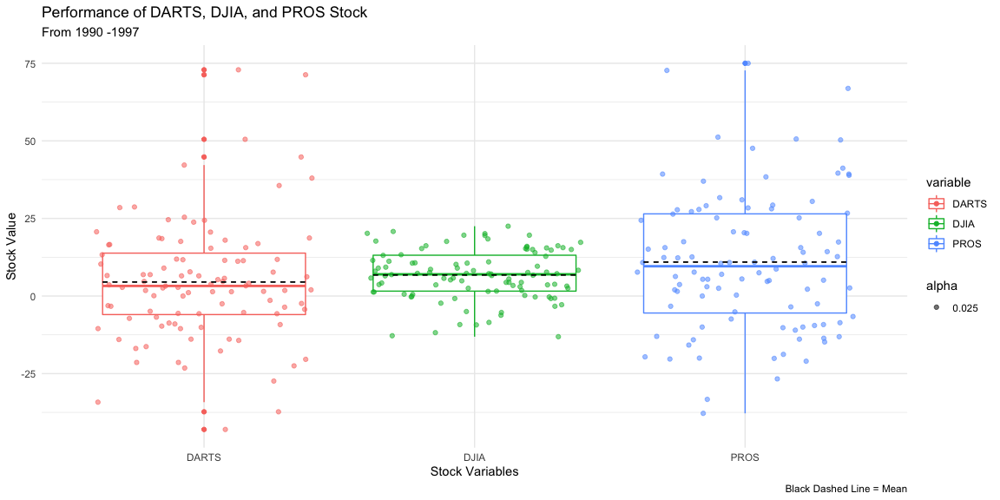

### Background

Reading in the DOW data with 5 different comonly known file types.

-----


### Import Different File Types


###### RDS File


```r
# Read in the rds file

rds_file <- read_rds(url("https://github.com/byuistats/data/raw/master/Dart_Expert_Dow_6month_anova/Dart_Expert_Dow_6month_anova.RDS"))

pander(head(rds_file, 5))
```


----------------------------------------
   contest_period      variable   value 
--------------------- ---------- -------
  January-June1990       PROS     12.7  

  February-July1990      PROS     26.4  

  March-August1990       PROS      2.5  

 April-September1990     PROS      -20  

   May-October1990       PROS     -37.8 
----------------------------------------


###### CSV File


```r
# Read in the CSV file

csv_file <- read_csv("https://raw.githubusercontent.com/byuistats/data/master/Dart_Expert_Dow_6month_anova/Dart_Expert_Dow_6month_anova.csv")

pander(head(csv_file, 5))
```


----------------------------------------
   contest_period      variable   value 
--------------------- ---------- -------
  January-June1990       PROS     12.7  

  February-July1990      PROS     26.4  

  March-August1990       PROS      2.5  

 April-September1990     PROS      -20  

   May-October1990       PROS     -37.8 
----------------------------------------


###### DTA File


```r
# Read in the dta file

dta_file <- read_dta("https://github.com/byuistats/data/raw/master/Dart_Expert_Dow_6month_anova/Dart_Expert_Dow_6month_anova.dta")

pander(head(dta_file, 5))
```


----------------------------------------
   contest_period      variable   value 
--------------------- ---------- -------
  January-June1990       PROS     12.7  

  February-July1990      PROS     26.4  

  March-August1990       PROS      2.5  

 April-September1990     PROS      -20  

   May-October1990       PROS     -37.8 
----------------------------------------


###### SAV File


```r
# Read in the sav file

sav_file <- read_sav("https://github.com/byuistats/data/blob/master/Dart_Expert_Dow_6month_anova/Dart_Expert_Dow_6month_anova.sav?raw=true")

pander(head(sav_file, 5))
```


----------------------------------------
   contest_period      variable   value 
--------------------- ---------- -------
  January-June1990       PROS     12.7  

  February-July1990      PROS     26.4  

  March-August1990       PROS      2.5  

 April-September1990     PROS      -20  

   May-October1990       PROS     -37.8 
----------------------------------------


###### XLSX File


```r
# Read in the xlsx file

tmpx <- tempfile()

download("https://github.com/byuistats/data/blob/master/Dart_Expert_Dow_6month_anova/Dart_Expert_Dow_6month_anova.xlsx?raw=true", tmpx, mode = "wb")

xlsx_file <- read_xlsx(tmpx)

pander(head(xlsx_file, 5))
```


----------------------------------------
   contest_period      variable   value 
--------------------- ---------- -------
  January-June1990       PROS     12.7  

  February-July1990      PROS     26.4  

  March-August1990       PROS      2.5  

 April-September1990     PROS      -20  

   May-October1990       PROS     -37.8 
----------------------------------------


### Check All Files Are Equal


```r
all.equal(rds_file, csv_file)
```

```
## [1] TRUE
```

```r
all.equal(rds_file, dta_file)
```

```
## [1] TRUE
```

```r
all.equal(rds_file, sav_file)
```

```
## [1] TRUE
```

```r
all.equal(rds_file, xlsx_file)
```

```
## [1] TRUE
```

-----

### Graphic


```r
stock <- csv_file %>%
  group_by(variable) %>% 
  select(variable, value)

ggplot(data=stock, aes(x = variable, y = value, color = variable)) +
  geom_boxplot() +
  geom_jitter(height = 0, mapping = aes(alpha = .025, color = variable)) +
  stat_summary(fun.y = mean, geom="errorbar", aes(ymax=..y..,ymin=..y.., group = factor(variable)), 
               width=0.75, linetype="dashed", size=.5, color="black") +
  labs(title = "Performance of DARTS, DJIA, and PROS Stock", subtitle = "From 1990 -1997", x = "Stock Variables", y = "Stock Value", caption = "Black Dashed Line = Mean") +
  theme_minimal()
```

<!-- -->

