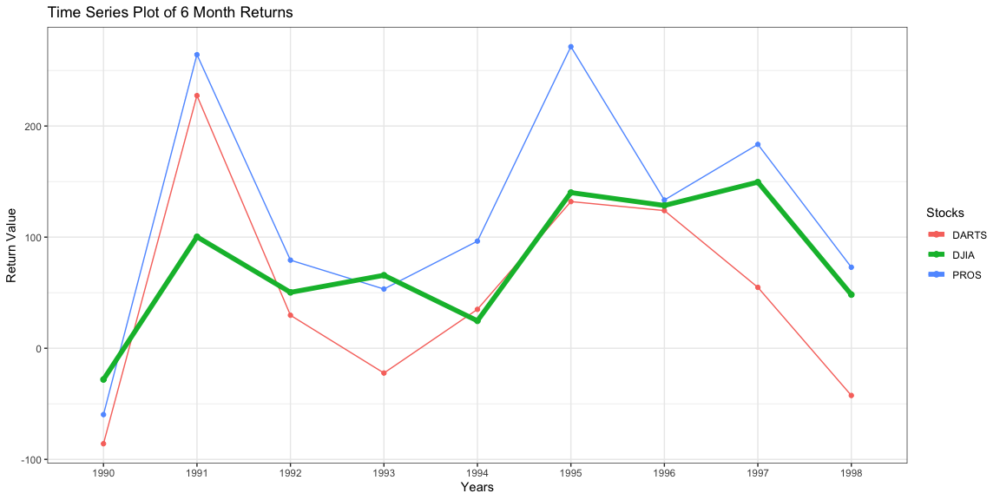

#### Read-in the data


```r
# Use this R-Chunk to import all your datasets!

tmpx <- tempfile()

download("https://github.com/byuistats/data/blob/master/Dart_Expert_Dow_6month_anova/Dart_Expert_Dow_6month_anova.xlsx?raw=true", tmpx, mode = "wb")

xlsx_file <- read_xlsx(tmpx)

pander(head(xlsx_file, 5))
```


----------------------------------------
   contest_period      variable   value 
--------------------- ---------- -------
  January-June1990       PROS     12.7  

  February-July1990      PROS     26.4  

  March-August1990       PROS      2.5  

 April-September1990     PROS      -20  

   May-October1990       PROS     -37.8 
----------------------------------------

-----

#### Tidy the Data


```r
# Use this R-Chunk to clean & wrangle your data!

tidy_contest <- xlsx_file %>%
  separate(contest_period, into = c("start", "end"), sep = "-") %>%
  mutate(year_end = substr(end, nchar(end) - 3, nchar(end))) %>% 
  separate(end, into = "Month", sep = -4) %>% 
  mutate(
    Month = replace(Month, Month == "Dec.", "December"),
    Month = replace(Month, Month == "Febuary", "February"))
  
pander(head(tidy_contest,10))
```


---------------------------------------------------------
     start         Month     variable   value   year_end 
--------------- ----------- ---------- ------- ----------
    January        June        PROS     12.7      1990   

   February        July        PROS     26.4      1990   

     March        August       PROS      2.5      1990   

     April       September     PROS      -20      1990   

      May         October      PROS     -37.8     1990   

     June        November      PROS     -33.3     1990   

     July        December      PROS     -10.2     1990   

  August1990      January      PROS     -20.3     1991   

 September1990   February      PROS     38.9      1991   

  October1990      March       PROS     20.2      1991   
---------------------------------------------------------

```r
saveRDS(tidy_contest, file = "tidy_contest.rds")
```

### Data Visualization


```r
tidy_contest2 <- tidy_contest %>% 
  group_by(year_end, variable) %>%
  summarise(value = sum(value)) %>%
  select(year_end, value, variable)

tidy_contest3 <- tidy_contest2 %>% 
  filter(variable != "DJIA")

tidy_contest4 <- tidy_contest2 %>% 
  filter(variable == "DJIA")

ggplot(data = tidy_contest3, aes(x = year_end, y = value, color = variable, group = variable)) +
  geom_point() +
  geom_line(aes(group = variable))+
  geom_point(data = tidy_contest4, size  = 2.0) +
  geom_line(data = tidy_contest4, size = 2.0) +
  labs(title = "Time Series Plot of 6 Month Returns", x = "Years", y = "Return Value", color = "Stocks")+
  theme_bw()
```

<!-- -->

This table shows the change in values for the DJIA, DARTS, and PROS stocks from 1990 to 1998.  This chart shows the overall change of the stock values from year to year.  The DJIA spread is much smaller than the spread of the other two stocks, while still showing a significant increase over the 9 year period.

### Data Table


```r
# Use this R-Chunk to plot & visualize your data!

wide_contest <- tidy_contest %>%
  filter(variable == "DJIA") %>%
  select(-variable, -start) %>% 
  pivot_wider(values_from = value, names_from = year_end) %>%
  mutate(Month = fct_relevel(Month, month.name)) %>% 
  arrange(Month)

pander(wide_contest)
```


----------------------------------------------------------------------------
   Month     1990    1991   1992   1993   1994   1995   1996   1997   1998  
----------- ------- ------ ------ ------ ------ ------ ------ ------ -------
  January     NA     -0.8   6.5    -0.8   11.2   1.8     15    19.6   -0.3  

 February     NA      11    8.6    2.5    5.5    3.2    15.6   20.1   10.7  

   March      NA     15.8   7.2     9     1.6    7.3    18.4   9.6     7.6  

   April      NA     16.2   10.6   5.8    0.5    12.8   14.8   15.3   22.5  

    May       NA     17.3   17.6   6.7    1.3    19.5    9     13.3   10.6  

   June       2.5    17.7   3.6    7.7    -6.2    16    10.2   16.2    15   

   July      11.5    7.6    4.2    3.7    -5.3   19.6   1.3    20.8    7.1  

  August     -2.3    4.4    -0.3   7.3    1.5    15.3   0.6    8.3    -13.1 

 September   -9.2    3.4    -0.1   5.2    4.4     14    5.8    20.2   -11.8 

  October    -8.5    4.4     -5    5.7    6.9    8.2    7.2     3      NA   

 November    -12.8   -3.3   -2.8   4.9    -0.3   13.1   15.1   3.8     NA   

 December    -9.3    6.6    0.2     8     3.6    9.3    15.5   -0.7    NA   
----------------------------------------------------------------------------

This is the data used to create the chart above. This table shows us the actual values of the DJIA stock from month to month over the course of the 9 years.  You can see that viewing the data in this format, it is much more difficult to see the change in data over time.  It does however help you to be able to view the actual values as needed.
