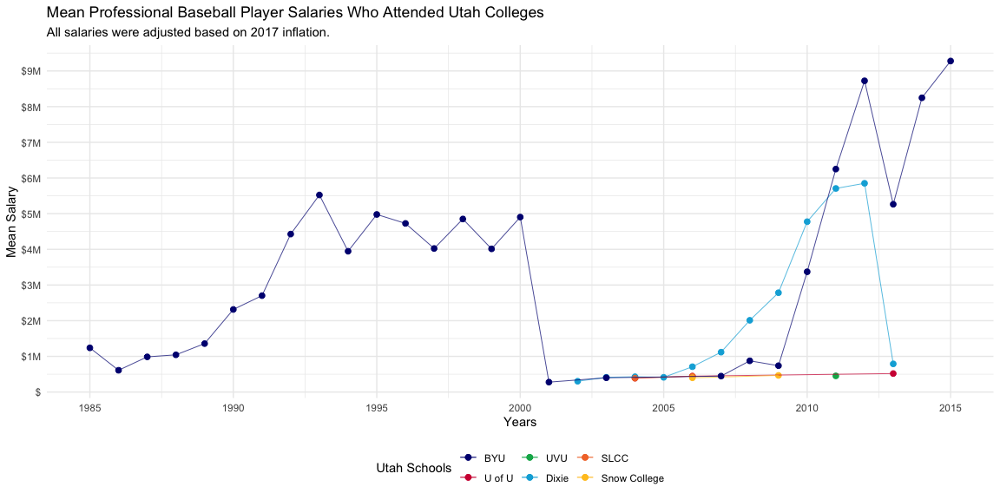
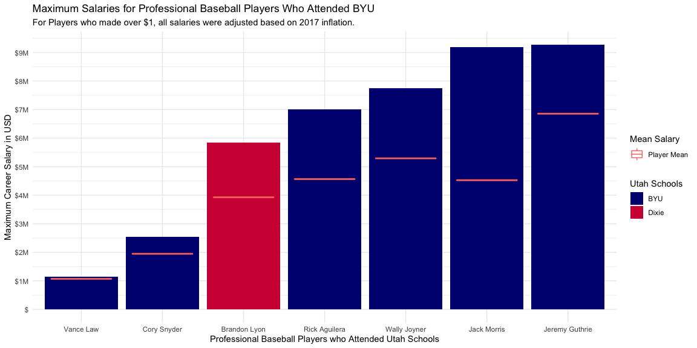

### Take me out to the ball game


-----


```r
# prep data for graphs

byu_players <- utah_inflation %>% 
  filter(adj_salary >= 1000000) %>%
  group_by(`Full Name`, schoolID) %>% 
  summarise(mean_salary = mean(adj_salary), max_salary = max(adj_salary)) %>%
  select(`Full Name`, schoolID, max_salary, mean_salary)


utah_salary <- utah_inflation %>% 
  filter(schoolID != "byu") %>%
  group_by(schoolID, yearID) %>% 
  summarise(mean_salary = mean(adj_salary))

byu_salary <- utah_inflation %>% 
  filter(schoolID == "byu") %>%
  group_by(schoolID, yearID) %>% 
  summarise(mean_salary = mean(adj_salary))


byu_years <- utah_inflation %>% 
  filter(schoolID == "byu") %>%
  group_by(`Full Name`, yearID) %>% 
  summarise(mean_salary = mean(adj_salary))
```

### Mean Player Professional Salary


```r
ggplot(mapping = aes(color = schoolID)) +
  geom_point(data = utah_salary, size = 2, mapping = aes (x = yearID, y = mean_salary)) + 
  geom_line(data = utah_salary, size = .25, mapping = aes (x = yearID, y = mean_salary)) + 
  geom_point(data = byu_salary, size = 2.0, mapping = aes (x = yearID, y = mean_salary)) +
  geom_line(data = byu_salary, size = .25, mapping = aes (x = yearID, y = mean_salary)) +
  labs(title = "Mean Professional Baseball Player Salaries Who Attended Utah Colleges", subtitle = "All salaries were adjusted based on 2017 inflation.", x = "Years", y = "Mean Salary", color = "Utah Schools") + 
  scale_y_continuous(breaks = c(0, 1000000, 2000000, 3000000, 4000000,5000000, 6000000, 7000000, 8000000, 9000000), labels = c("$", "$1M", "$2M", "$3M", "$4M","$5M", "$6M", "$7M", "$8M", "$9M")) +
  scale_color_manual(values = c("navyblue", "#d11141", "#00b159", "#00aedb", "#f37735", "#ffc425"), labels = c("BYU", "U of U", "UVU", "Dixie", "SLCC", "Snow College")) +
  scale_x_continuous(breaks = c(1985,1990,1995, 2000, 2005, 2010, 2015), labels = c("1985", "1990", "1995", "2000", "2005", "2010", "2015")) +
  theme_minimal() + 
  theme(legend.position = "bottom")
```

<!-- -->

### Maximum Player Salary


```r
ggplot(data = byu_players, mapping = aes(x = reorder(`Full Name`, max_salary), y = max_salary)) +
  geom_bar(stat = "identity", aes(fill = schoolID))+
  geom_boxplot(aes(y = mean_salary, color = "Player Mean")) +
  labs(title = "Maximum Salaries for Professional Baseball Players Who Attended BYU", subtitle = "For Players who made over $1, all salaries were adjusted based on 2017 inflation.", x = "Professional Baseball Players who Attended Utah Schools", y = "Maximum Career Salary in USD", fill = "Utah Schools", color = "Mean Salary") + 
 scale_y_continuous(breaks = c(0, 1000000, 2000000, 3000000, 4000000,5000000, 6000000, 7000000, 8000000, 9000000), labels = c("$", "$1M", "$2M", "$3M", "$4M","$5M", "$6M", "$7M", "$8M", "$9M")) +
  theme(axis.ticks.x = element_blank()) + 
  scale_fill_manual(values = c("navyblue", "#d11141"), labels = c("BYU", "Dixie")) +
  theme_minimal()
```

<!-- -->

-----

##### Utah Player Player Mean Salary by Player


```r
pander(byu_players)
```


------------------------------------------------------
   Full Name      schoolID   max_salary   mean_salary 
---------------- ---------- ------------ -------------
  Brandon Lyon    utdixie     5851064       3927207   

  Cory Snyder       byu       2542373       1947925   

  Jack Morris       byu       9194915       4525722   

 Jeremy Guthrie     byu       9278351       6855520   

 Rick Aguilera      byu       7016129       4564702   

   Vance Law        byu       1141304       1070652   

  Wally Joyner      byu       7741935       5292019   
------------------------------------------------------

##### BYU Mean Salary By Year


```r
pander(byu_salary)
```


---------------------------------
 schoolID   yearID   mean_salary 
---------- -------- -------------
   byu       1985      1238637   

   byu       1986      610494    

   byu       1987      986073    

   byu       1988      1043424   

   byu       1989      1357909   

   byu       1990      2314580   

   byu       1991      2702381   

   byu       1992      4427632   

   byu       1993      5523883   

   byu       1994      3946154   

   byu       1995      4977957   

   byu       1996      4726562   

   byu       1997      4024038   

   byu       1998      4850746   

   byu       1999      4013058   

   byu       2000      4903642   

   byu       2001      277778    

   byu       2003       4e+05    

   byu       2007      447059    

   byu       2008      875000    

   byu       2009      738636    

   byu       2010      3370787   

   byu       2011      6250000   

   byu       2012      8723404   

   byu       2013      5263158   

   byu       2014      8247423   

   byu       2015      9278351   
---------------------------------

