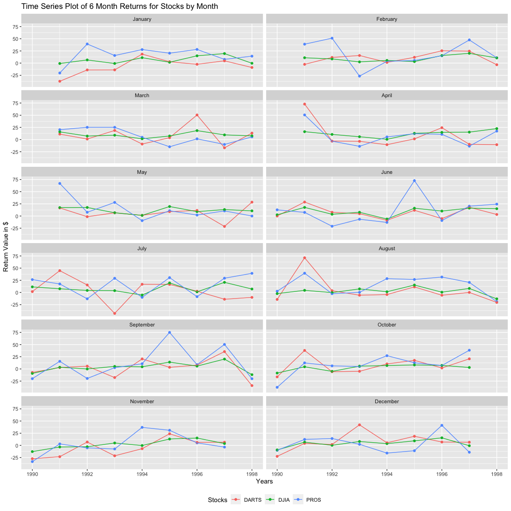

```r
tmpx <- tempfile()

download("https://github.com/byuistats/data/blob/master/Dart_Expert_Dow_6month_anova/Dart_Expert_Dow_6month_anova.xlsx?raw=true", tmpx, mode = "wb")

xlsx_file <- read_xlsx(tmpx)

tidy_contest <- xlsx_file %>%
  separate(contest_period, into = c("start", "end"), sep = "-") %>%
  mutate(year_end = substr(end, nchar(end) - 3, nchar(end))) %>% 
  separate(end, into = "Month", sep = -4) %>% 
  mutate(
    Month = replace(Month, Month == "Dec.", "December"),
    Month = replace(Month, Month == "Febuary", "February"))
```


```r
wide_stock <- tidy_contest %>%
  select(-start) %>% 
  pivot_wider(values_from = value, names_from = year_end) %>%
  mutate(Month = fct_relevel(Month,month.name)) %>% 
  arrange(Month)
```

#### Stock Data Line Plot

###### Stock Data by Month


```r
longer_stock <- tidy_contest %>%
  mutate(year_end = as.numeric(year_end)) %>%  
  group_by(year_end, variable ) %>% 
  select(-start) %>%
  mutate(Month = fct_relevel(Month, month.name)) %>% 
  arrange(Month)

ggplot(data = longer_stock, aes(x = year_end, y = value, color = variable, group = variable)) +
  geom_point() +
  geom_line(aes(group = variable)) +
  facet_wrap(~fct_relevel(Month, month.name), ncol = 2) +
  theme(legend.position = "bottom") +
  labs(title = "Time Series Plot of 6 Month Returns for Stocks by Month", x = "Years", y = "Return Value in $", color = "Stocks")
```

<!-- -->

This graph is useful for noticing the monthly or seasonal trends for each stock value.  The most noticable difference, is that the PROS stock historically performs better in January than the other two stocks. DJIA is the most steadily performing stock with no large jumps or dips over any month during the 8 year period.  DARTS shows more vaiability between years and months than the other two stocks.

-----

#### Stock Data Tables

##### PROS Stock Values by Month


```r
pros_stock <- wide_stock %>% 
  filter(variable == "PROS") %>% 
  select (-variable)

pander(pros_stock)
```


----------------------------------------------------------------------------------
   Month     1990    1991    1992    1993    1994    1995    1996   1997    1998  
----------- ------- ------- ------- ------- ------- ------- ------ ------- -------
  January     NA     -20.3   39.3    15.6    27.8    20.4    28.1    7.7    14.3  

 February     NA     38.9    51.2    -26.7    3.7     5.4    15.1   47.6    10.9  

   March      NA     20.2    25.2    25.2     4.7    -14.8   1.5     -10     5.5  

   April      NA     50.6    -3.3    -13.9    5.4    12.1    10.8   -13.6   17.4  

    May       NA     66.9     7.7    27.9    -9.5    10.8     2     10.5      0   

   June      12.7     7.5     -21    -6.6    -13.1   72.7    -9.2   20.2    24.4  

   July      26.4    17.5     -13    29.1     -10    30.5    -8.6   29.3    39.3  

  August      2.5    39.6    -2.5     0.3    28.4    26.7    31.7   20.7    -18.8 

 September    -20    15.6    -19.6    2.6    10.6     75     8.7    50.3    -20.1 

  October    -37.8   12.4     6.3      5     27.2    12.6     7     38.4     NA   

 November    -33.3     3     -5.1    -7.4     37      31     5.1    -3.5     NA   

 December    -10.2   12.3    14.1     2.2    -15.8    -11    41.2   -14.1    NA   
----------------------------------------------------------------------------------

##### DARTS Stock Values by Month


```r
darts_stock <- wide_stock %>% 
  filter(variable == "DARTS") %>% 
  select (-variable)

pander(darts_stock)
```


--------------------------------------------------------------------------------
   Month     1990    1991    1992   1993    1994    1995   1996   1997    1998  
----------- ------- ------- ------ ------- ------- ------ ------ ------- -------
  January     NA     -37.3   -14    -13.9   18.5    2.8    -2.4    4.7     -9   

 February     NA     -2.5    11.7   15.6     1.5    11.9   25.4   24.6    -3.3  

   March      NA     11.2    1.1    18.7    -9.2    3.8    50.5   -16.9   13.3  

   April      NA     72.9    -3.1   -3.6    -10.5   1.4    24.4   -9.7    -10.5 

    May       NA     16.6    -1.4    6.6     1.4     9     11.5   -21.4   28.5  

   June        0     28.7    7.7     4.7    -8.7    11.8   -5.3    18      3.2  

   July       1.8    44.8    15.4    -43    16.9    16.5   2.6    -13.9   -10.1 

  August     -14.3   71.3    3.6    -5.6    -4.3    11.4   -5.7    0.1    -20.4 

 September   -7.2     2.8    5.7    -17.7   20.6    3.3    7.8    35.6    -34.2 

  October    -16.3    38     -5.7   -4.9    10.3    17.6    2     20.7     NA   

 November    -27.4   -23.2   6.9    -21.4   -6.8    23.8   6.2     6.5     NA   

 December    -22.5    4.1    1.8    42.2     5.3    18.7   6.9     6.5     NA   
--------------------------------------------------------------------------------

##### DJIA Stock Values by Month


```r
djia_stock <- wide_stock %>% 
  filter(variable == "DJIA") %>% 
  select (-variable)

pander(djia_stock)
```


----------------------------------------------------------------------------
   Month     1990    1991   1992   1993   1994   1995   1996   1997   1998  
----------- ------- ------ ------ ------ ------ ------ ------ ------ -------
  January     NA     -0.8   6.5    -0.8   11.2   1.8     15    19.6   -0.3  

 February     NA      11    8.6    2.5    5.5    3.2    15.6   20.1   10.7  

   March      NA     15.8   7.2     9     1.6    7.3    18.4   9.6     7.6  

   April      NA     16.2   10.6   5.8    0.5    12.8   14.8   15.3   22.5  

    May       NA     17.3   17.6   6.7    1.3    19.5    9     13.3   10.6  

   June       2.5    17.7   3.6    7.7    -6.2    16    10.2   16.2    15   

   July      11.5    7.6    4.2    3.7    -5.3   19.6   1.3    20.8    7.1  

  August     -2.3    4.4    -0.3   7.3    1.5    15.3   0.6    8.3    -13.1 

 September   -9.2    3.4    -0.1   5.2    4.4     14    5.8    20.2   -11.8 

  October    -8.5    4.4     -5    5.7    6.9    8.2    7.2     3      NA   

 November    -12.8   -3.3   -2.8   4.9    -0.3   13.1   15.1   3.8     NA   

 December    -9.3    6.6    0.2     8     3.6    9.3    15.5   -0.7    NA   
----------------------------------------------------------------------------
